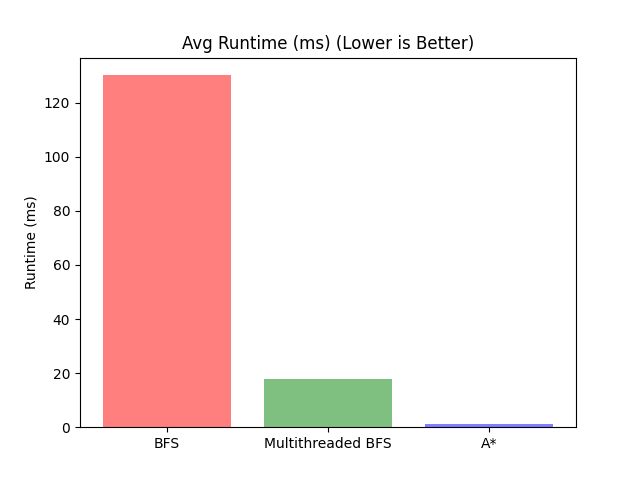

# Parallel Algorithms Analysis

**Group Members:**
- Daniel Tebor
- Merrick McPherson

*Course CS4306*

*Kennesaw State University - College of Computing and Software Engineering*

# Introduction and Project Overview

In the ever-evolving landscape of computational algorithms, the pursuit of optimizing search processes is a critical endeavor. This project delves into the intricate realm of search algorithm optimization, specifically exploring the potential performance enhancements achieved through parallelizing search algorithms as opposed to the traditional approach of augmenting them with heuristic techniques.

Our primary focus lies in unraveling the comparative advantages and nuances of these two distinct methodologies. By dissecting the search process and introducing parallelization techniques, we aim to uncover the efficiency gains and computational advantages that may be harnessed. Moreover, we will contrast this approach with the application of heuristics, seeking to determine the most effective strategy for enhancing search algorithms in various contexts.

This comprehensive report unfolds with a detailed exploration of our aims and objectives, providing a roadmap for our investigation. We pivot to the puzzle problem chosen as the litmus test for algorithmic performance, offering insights into the intricacies of the challenges posed and the overarching goals each algorithm aspires to achieve.

Moreover, we embark on a concise overview of the literature and online resources that have steered our project, highlighting the foundational knowledge and cutting-edge insights that shaped our analytical framework. Drawing from a diverse range of scholarly contributions and practical implementations, our approach is fortified by a synthesis of the latest advancements in the field.

The subsequent sections of this report navigate through the meticulously chosen methodologies employed in the study. From the inception of the project to the final implementation of algorithms, we detail the systematic approach taken to study, analyze, and program these intricate search algorithms. The narrative then seamlessly transitions to an exposition of the empirical results, providing a comprehensive account of how these algorithms performed under various conditions and scenarios.

Concluding this exploration is a succinct yet insightful reflection on the outcomes, encapsulated in a conclusive section. Here, we synthesize the findings, discuss their implications, and present a holistic understanding of the optimized search algorithms' efficacy in light of our objectives.

By traversing this project, readers will gain not only a nuanced understanding of parallelized search algorithms and heuristic-enhanced counterparts but also a profound insight into the dynamic interplay between theory and implementation in the realm of computational optimization.

# Aims and Objectives

The primary objective of this project is to conduct a thorough performance evaluation of three distinct algorithms, namely Breadth First Search (BFS), Multithreaded Breadth First Search, and the A* (pronounced A-star) algorithm, in the context of solving the well-known 8-puzzle problem. The 8-puzzle problem, a classic and widely studied puzzle, involves a 3x3 grid with eight numbered tiles and one empty tile. The challenge is to rearrange these tiles by sliding them into the empty space, ultimately reaching a predefined goal state where the numbered tiles are in the correct order.

In our project, we have specifically configured the 8-puzzle to consist of 8 numbered tiles and one empty blank space tile. This puzzle serves as an ideal testbed for evaluating the efficiency and effectiveness of the selected algorithms in solving real-world combinatorial problems.

The algorithms under scrutiny each bring unique characteristics to the table. Breadth First Search is a systematic and reliable search algorithm that exhaustively explores all possible paths to find the shortest solution. The Multithreaded Breadth First Search, a parallelized adaptation of BFS, harnesses the computational power of multiple CPU cores to expedite the search process. Finally, the A* algorithm, known for its popularity and efficiency in pathfinding, employs heuristics to guide its search, striking a balance between optimality and computational efficiency.

Our evaluation metrics encompass a comprehensive set of criteria, including runtimes, moves to goal, nodes visited, space complexity, and time complexity. Through a meticulous analysis of these metrics, we aim to provide a nuanced and holistic performance review of each algorithm. By scrutinizing their performance across various dimensions, we seek to discern the strengths and weaknesses of these algorithms under the specific constraints posed by the 8-puzzle problem.

This investigation is not only instrumental in gauging the capabilities of these algorithms but also contributes valuable insights into their practical applicability in solving complex problems. As we navigate through the subsequent sections of this report, we invite readers to join us in unraveling the intricate dynamics of algorithmic performance, with a specific focus on the challenges posed by the 8-puzzle problem.

# Brief Literature Review

## Background

The foundation of this project has been significantly influenced by the collective experiences and expertise of the team members, Daniel and Merrick.

### Daniel's Experience

In a previous AI class, Daniel played a pivotal role in the development of a comprehensive code base for algorithm analysis. His prior work serves as the cornerstone for the current project, providing valuable insights and a robust starting point for the exploration of optimized search algorithms. Leveraging his expertise, Daniel has contributed to shaping the methodology and approach undertaken in this endeavor.

### Merrick's Experience

Merrick brings a wealth of knowledge in parallel programming, acquired through a different class. His background in this specialized area has been instrumental in guiding the project towards efficient parallelization of search algorithms. Merrick's insights have played a crucial role in optimizing the utilization of multiple CPU cores, thereby enhancing the overall computational efficiency of the algorithms under examination.

## External References

In addition to the team's internal expertise, the project has been enriched by consulting external resources that have significantly informed its direction.

### Textbook Reference

- **"Distributed Computing: Principles and Applications" by M. L. Liu:**
  This textbook has served as a foundational resource, offering comprehensive insights and principles in the domain of distributed and parallel computing. The principles extracted from this source have been instrumental in shaping the theoretical framework of the project. Concepts and methodologies discussed in the book have guided the team in developing a nuanced understanding of the complexities involved in parallelizing search algorithms.

### Software Library

- **"oneAPI Threading Building Blocks" (a C++ library):**
  To facilitate the implementation of parallelization techniques and ensure optimal utilization of multi-core processing, the team has incorporated the "oneAPI Threading Building Blocks" C++ library. This library simplifies the intricacies of parallel programming, providing a robust foundation for developing efficient and scalable algorithms. The integration of this library aligns with best practices in parallel computing and enhances the project's ability to harness the computational power of modern hardware architectures.

## Synthesis of Literature

The combination of internal expertise and external references has laid a robust foundation for this project. The literature review has not only shaped the methodology but has also provided the team with a well-rounded perspective on the intricacies of parallel computing and algorithm optimization. As we delve deeper into the subsequent sections of this report, the synthesis of literature continues to guide our approach and analysis, ensuring a comprehensive exploration of the chosen search algorithms in the context of parallelization and heuristic enhancement.

# Methodologies
To facilitate the evaluation of the breadth-first search, multithreaded breadth-first search, and A* search, these algorithms had to be built from scratch. Each has a similar, but slightly different implementation. However, all are dependent on the mechanics of the 8-puzzle Problem.

## Representing 8-puzzle
Creating an 8-puzzle in a way in which a search algorithm can use it requires two things: the board to be representable in memory as a node, and for the current node to be extendable to reach the next available moves. Firstly, a node structure was configured. This Node contains a 3x3 grid, representing the state of the 8-puzzle board, with the number 0 representing the empty tile. The node also stores a pointer to its parent (the previous move) so that we can trace from the starting position of the board to the current position. In addition, the node also stores the current depth of the node (which starts at 0), which also describes how many moves it has taken thus far to reach the goal. Finally, the node stores a heuristic value. This value is only populated when A* is being utilized and is used to estimate the best next move.

### Extending the Current Node
To extend the current node, the first step is to find the position of the empty tile. This can be done by looping through the 3x3 grid until the position of the tile with "0" is found. From there we can try to move in all 4 directions, rejecting any moves that attempt to move outside the bounds of the board. For example, if the empty tile is in the top-right corner, it cannot move up or right since this would be outside the bounds of the grid, so those moves are rejected. Another requirement is that a child node's 3x3 grid cannot be identical to any previously visited tile. To ensure this, every visited node is stored in a hashed-set data structure. This allows for an average lookup time of O(1), making this process extremely efficient.

### Branching Factor
Since a generated child node cannot be the same as the previous move it is generated from, we can always subtract 1 from the possible moves at any given board state. Using this idea we can calculate a rough estimate of the the branching factor for each node. If the empty tile is in a corner, there is only one possible move it can make. If the empty tile is touching one of the sides, it has 2 possible moves. Finally, if the tile is in the middle it has 3 possible moves. There are 4 corners, 4 sides, and 1 center position, so we can calculate a rough branching factor by summing the possible moves at each position divided by the total number of positions: ((1 * 4) + (2 * 4) + 3) / 9. This results in a rough average branching factor of 1.67.

## Search Algorithm Implementations
Each of the search algorithms was written in C++ and utilizes the same algorithm for expanding the current node. The goal node was hard coded to the following value:
| 1 | 2 | 3 |
| - | - | - |
| 8 | 0 | 4 |
| 7 | 6 | 5 |

A random start node was then generated by scrambling the 3x3 grid of the goal node by doing 1000000 random moves.

### Breadth First Search (BFS)
Breadth first search explores every possible state systematically. It does this depth-wise, meaning that it will explore all nodes of depth 0, then all nodes of depth 1, etc. until a goal node is found. This garuntees that the shortest possible path (number of moves) is found from the start to the goal. The steps for the algorithm are as follows and use C++ datatypes:

1. Initialize a deque (double-ended queue) to store the nodes that need to be expanded. This deque will be used as a queue, meaning that nodes will be added to the back and removed from the front.
2. Initialize an unordered set to store the nodes that have already been visited. This will be used to ensure that no duplicate nodes are expanded.
3. Add the start node to the deque.

**While the deque is not empty:**

4. Pop the front node from the deque and add it to the visited set.
5. If the node is the goal node, return it.
6. Otherwise, expand the node and add all of its children to the back of the deque.

This results in a depth-wise search order, as the deque is a FIFO (first in, first out) data structure. The deque is used instead of a queue because the deque has a constant time complexity for both adding and removing elements, whereas a queue has a linear time complexity for removing elements.

#### BFS Time and Space Complexity
Breadth first search has a time complexity of O(d^b), where d is the depth and b is the branching factor, which we have established. The space complexity is also the same, O(d^b), since the algorithm must store all nodes of depth d in memory at the same time. This means that the time and space complexity of BFS is exponential, and the runtime is heavily dependent on which depth the goal node is located in.

### Multithreaded Breadth First Search (MTBFS)
Multithreaded breadth first search is a parallelized version of BFS. It utilizes the same algorithm as BFS, but instead of using a single thread to expand nodes, it uses multiple threads by having a nodes to visit deque for each thread. The nodes visited set is accessed concurrently by each thread to ensure that no nodes are repeated. The built in unordered set datatype in C++ is not thread-safe, so we used the concurrent unordered set from Intel's Thread Building Blocks (TBB) library. The concurrent unordered set provides safe concurrent reading and writing, allowing for an efficient MTBFS implementation. The steps for the algorithm are as follows:

1. Start a [single-threaded BFS](#breadth-first-search-bfs), stopping once the number of nodes in the nodes to visit deque is greater than or equal to the number of available cpu threads or if the goal node is found.
2. Evenly split the nodes to visit deque into an individual deque for each thread.
3. Start a thread for each deque, passing in the deque and the nodes visited set (which is a concurrent unordered set in this implementation).

**For each thread, while the deque is not empty:**

4. Pop the front node from the deque and add it to the visited set.
5. If the node is the goal node, return it and inform the other threads to stop.
6. Otherwise, expand the node and add all of its children to the back of the deque.

This implementation results in a breadth-wise search order, but executed over multiple threads.

#### MTBFS Time and Space Complexity
The time and space complexity of MTBFS are identical to the single-threaded BFS, O(d^b). However, the practical runtime is significantly reduced due to the parallelization of the algorithm. The runtime is still heavily dependent on which depth the goal node is located in, but the runtime is reduced by a factor of the number of threads used.

### A* Search
A* search has a similar implementation to BFS. However, instead of a normal queue it uses a priority queue. The priority queue is sorted by the depth of the node plus the heuristic value of the node. This causes nodes with a lower depth and a lower heuristic value to be expanded first, which leads the algorithm to the goal node faster. The heuristic calculated for each node are the Nilsson sequence score and the Manhattan distance score. The Nilsson sequence score is calculated by adding one to the score if the center is not empty, and adding 2 to the score for each tile found to be out of place when searching the edge of the grid in clockwise fasion. Finally, the Nilsson sequence score is multiplied by 3 to weight it. The other heuristic used was the Manhattan distance score, which sums the absolute values of the x distance and y distance from where a tile is supposed to be in the goal node. The heuristics cause the algorithm to favor nodes that are more likely to be closer to the goal node. The steps for the algorithm are as follows:

1. Initialize a priority queue to store the nodes that need to be expanded. This priority queue will be used as a queue, meaning that nodes will be added to the back and removed from the front, but are sorted by the depth of the node plus the heuristic value of the node, where lower values are at the front.
2. Initialize an unordered set to store the nodes that have already been visited. This will be used to ensure that no duplicate nodes are expanded.
3. Add the start node to the priority queue.

**While the priority queue is not empty:**

4. Pop the front node from the priority queue and add it to the visited set.
5. If the node is the goal node, return it.
6. Otherwise, expand the node and add all of its children to the priority queue.

This results in a search order that are likely to be closer to the goal node first, causing the algorithm to find the goal node faster than BFS. However, this could result in the algorithm searching at a greater depth than BFS, and may not find the shortest path to the goal node.

#### A* Time and Space Complexity
A* search has the same time and space complexity as BFS, O(d^b). However, the practical runtime is significantly reduced due to the use of heuristics. That being said, if a heuristic that does not converge on the goal were to be used, then the runtime could be worse than BFS since it would not be searching in a depth-wise manner.

# Results
An imperical analysis of the three algorithms was conducted to evaluate their performance across various dimensions. For 10000 iterations, a start node was randomly generated and then fed into each of the algorithms. The algorithms were run on a PC with 16 cores and 64GB of memory. The metadata of these iterations was then plotted in order to analyze the algorithms.

## Runtime Analysis

    
    

*Figure 1: Average runtime of each algorithm (left) and moves to goal vs runtime (right)*

We can see from Figure 1 that the average runtime of each algorithm is significantly different. BFS has the highest runtime on average, at roughly 130ms. MTBFS has a much lower average runtime of roughly 19ms. However, the runtime of MTBFS is only about 7 times faster than BFS, implying that there is some overhead creating the threads and writing concurrently to the concurrent unordered nodes visited set. Finally, A* has the lowest average runtime of roughly 2ms. This is expected since A* uses heuristics to guide the search, which allows it to find the goal node faster than BFS and MTBFS.

We can also see that the runtime of each algorithm is heavily dependent on the number of moves to the goal. The difference between the algorithms is not pronounced until the moves to goal (which is also the depth) surpasses 15, at which point we see the runtime of BFS and MTBFS increase exponentially. This demonstrates the runtime complexity of O(d^b) for BFS and MTBFS. However, we see that MTBFS grows far less than BFS as the number of moves to goal increases. This is due to the parallelization of the algorithm, which allows for multiple nodes to be expanded at the same time. Finally, we see that the A* runtime stays relatively constant as the number of moves to goal increases. This is due to the use of heuristics, which allows the algorithm to find the goal node faster than BFS and MTBFS.

## Space Complexity Analysis

    
    

*Figure 2: Average number of nodes visited by each algorithm (left) and moves to goal vs nodes visited (right)*

We can see from Figure 2 the BFS and MTBFS visit roughly the same number of nodes on average. However, MTBFS is slightly higher and this can be explained by the fact that there are multiple threads searching at the same time, which can cause more nodes to be expanded overall before the goal node is found. We can also see that A* visits significantly less nodes on average than BFS and MTBFS due to its use of heuristics.

We can also see the space complexity demonstrated to be the same as O(d^b). As the number of moves to the goal increases, the number of nodes visited increases exponentially. We can also see that MTBFS is less consistent than BFS, but still overlaps with the BFS line. This is due to the parallelization of the algorithm, which allows for multiple nodes to be expanded at the same time. Finally, we see that the A* nodes visited stays relatively constant as the number of moves to goal increases due to the heuristic used.

## Moves to Goal Analysis

    

    

*Figure 3: Average moves to goal of each algorithm*

We can see from Figure 3 that BFS and MTBFS are optimal for finding the shortest possible path to the goal. That being said, on very rare occasion, MTBFS will find a path that is one move longer than BFS. This is caused by one of the threads moving onto the next depth before another thread finds the goal node at the current depth. However, this issue could be solved by blocking a thread from moving on to the next depth until every thread has completed its search at the current depth. This may, however, cause a slight decrease in the runtime efficiency. Finally, we can see that A* is not optimal for finding the shortest path to the goal. This is due to the use of heuristics, which can cause the algorithm to find the goal node at a greater depth than BFS and MTBFS. The Nilsson sequence score plus Manhatten distance score are non-admissable, meaning that they do not find the optimal path. However, if the heuristic used were admissable, then A* would find the optimal path and would be the superior algorithm.

# Conclusion

In conclusion, our exploration into parallel search algorithms and heuristic-based approaches for solving the 8-puzzle problem has provided valuable insights into the trade-offs and advantages associated with different strategies.

**A * for Speed:** A* emerges as the star performer when speed is the top priority. Its ability to swiftly navigate through the solution space makes it the preferred choice for scenarios where finding a quick resolution to the 8-puzzle problem is crucial. The efficiency of A* shines through, showcasing its prowess in rapidly converging towards solutions.

**BFS for Optimal Moves:** On the other hand, if the primary objective is to achieve optimal moves, Breadth-First Search (BFS) takes the lead. Its systematic exploration of the solution space ensures that the shortest path to the solution is identified. When the focus shifts from speed to the precision of moves, BFS stands out as the superior option.

**Multi-Threaded BFS:** However, our project delves deeper into the realm of optimization, introducing the concept of Multi-Threaded BFS. This approach not only preserves the optimal moves of BFS but also introduces a parallel processing element that significantly enhances runtime efficiency. The multi-threaded BFS proves to be the optimal choice when the goal is to minimize the number of moves while simultaneously outperforming the traditional BFS in terms of runtime.

In the evolving landscape of search algorithms, our project underscores the importance of understanding the specific priorities and requirements of a problem before selecting an appropriate solution strategy. A* for speed, BFS for optimal moves, and Multi-Threaded BFS for a harmonious blend of both — our project contributes to the nuanced understanding of these algorithms, paving the way for informed decision-making in problem-solving scenarios. As we conclude this report, we acknowledge the dynamic nature of algorithmic research and anticipate that future endeavors will continue to refine and expand upon the foundations laid in this project.

